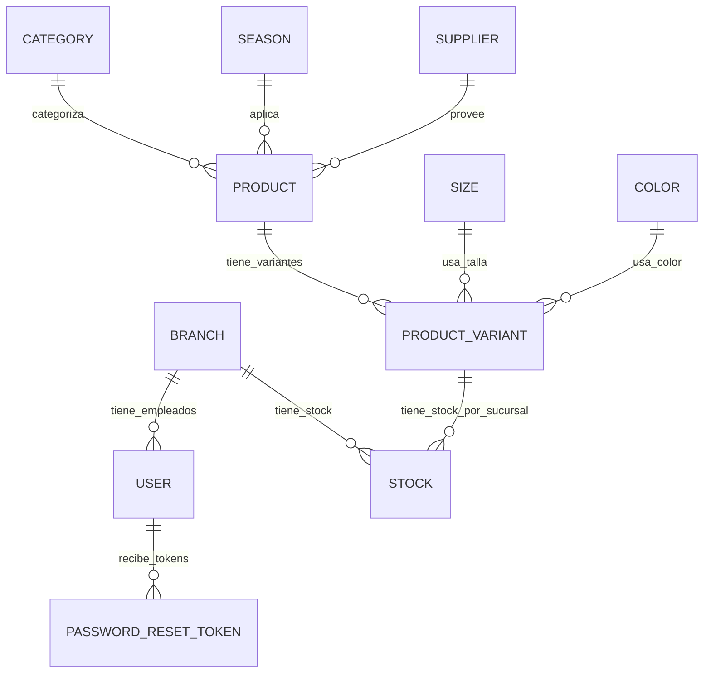

# Tablas y relaciones del backend

Este documento resume las tablas definidas en `app/models` y las relaciones entre ellas.

> Importante: esta carpeta no muestra las tablas del backend. Las tablas viven en `app/models`, mientras que `app/api` solo define los endpoints HTTP (`/api/v1/...`).

## 1) Resumen general

El backend tiene estas tablas actualmente definidas:

- `branches`
- `categories`
- `colors`
- `password_reset_tokens`
- `products`
- `product_variants`
- `seasons`
- `sizes`
- `stocks`
- `suppliers`
- `token_blacklist`
- `users`

## 2) Relación entre tablas

### Diagrama de relaciones

## 3) Definición de cada tabla

### `users`

Representa los usuarios del sistema.

Atributos:
- `id`: `String(36)`, PK, obligatorio, no puede ser `NULL`
- `email`: `String(255)`, único, obligatorio, no puede ser `NULL`
- `hashed_password`: `String(255)`, obligatorio, no puede ser `NULL`
- `full_name`: `String(255)`, obligatorio, no puede ser `NULL`
- `role`: `String(50)`, obligatorio, no puede ser `NULL`, valores esperados: `ADMIN`, `STORE_MANAGER`, `CASHIER`, `CUSTOMER`
- `phone`: `String(50)`, opcional, puede ser `NULL`
- `branch_id`: `String(36)`, FK a `branches.id`, opcional, puede ser `NULL`
- `is_active`: `Boolean`, obligatorio, no puede ser `NULL`
- `is_verified`: `Boolean`, obligatorio, no puede ser `NULL`
- `created_at`: `DateTime`, obligatorio, no puede ser `NULL`
- `updated_at`: `DateTime`, obligatorio, no puede ser `NULL`

Relaciones:
- `branches` → `users` (`branch_id`)
- `users` → `password_reset_tokens` (`user_id`)
- `branches` → `employees` (relación inversa)

---

### `branches`

Representa sucursales o locales.

Atributos:
- `id`: `String(36)`, PK, obligatorio, no puede ser `NULL`
- `name`: `String(100)`, obligatorio, no puede ser `NULL`
- `city`: `String(100)`, obligatorio, no puede ser `NULL`
- `address`: `String(255)`, obligatorio, no puede ser `NULL`
- `phone`: `String(50)`, opcional, puede ser `NULL`
- `opening_hours`: `String(100)`, opcional, puede ser `NULL`
- `is_active`: `Boolean`, obligatorio, no puede ser `NULL`
- `created_at`: `DateTime`, obligatorio, no puede ser `NULL`
- `updated_at`: `DateTime`, obligatorio, no puede ser `NULL`

Relaciones:
- `branches` → `users` (`employees`)
- `branches` → `stocks` (`branch_id`)

---

### `categories`

Categorías de productos.

Atributos:
- `id`: `String(36)`, PK, obligatorio, no puede ser `NULL`
- `name`: `String(100)`, único, obligatorio, no puede ser `NULL`
- `description`: `String(255)`, opcional, puede ser `NULL`
- `is_active`: `Boolean`, obligatorio, no puede ser `NULL`
- `created_at`: `DateTime`, obligatorio, no puede ser `NULL`
- `updated_at`: `DateTime`, obligatorio, no puede ser `NULL`

Relaciones:
- `categories` → `products` (`category_id`)

---

### `colors`

Colores disponibles para variantes de producto.

Atributos:
- `id`: `String(36)`, PK, obligatorio, no puede ser `NULL`
- `name`: `String(50)`, único, obligatorio, no puede ser `NULL`
- `hex_code`: `String(7)`, obligatorio, no puede ser `NULL`
- `is_active`: `Boolean`, obligatorio, no puede ser `NULL`
- `created_at`: `DateTime`, obligatorio, no puede ser `NULL`
- `updated_at`: `DateTime`, obligatorio, no puede ser `NULL`

Relaciones:
- `colors` → `product_variants` (`color_id`)

---

### `sizes`

Tallas disponibles.

Atributos:
- `id`: `String(36)`, PK, obligatorio, no puede ser `NULL`
- `name`: `String(50)`, obligatorio, no puede ser `NULL`
- `code`: `String(20)`, único, obligatorio, no puede ser `NULL`
- `category_type`: `String(50)`, opcional, puede ser `NULL`, por defecto `GENERAL`
- `is_active`: `Boolean`, obligatorio, no puede ser `NULL`
- `created_at`: `DateTime`, obligatorio, no puede ser `NULL`
- `updated_at`: `DateTime`, obligatorio, no puede ser `NULL`

Relaciones:
- `sizes` → `product_variants` (`size_id`)

---

### `seasons`

Temporadas o campañas.

Atributos:
- `id`: `String(36)`, PK, obligatorio, no puede ser `NULL`
- `name`: `String(100)`, único, obligatorio, no puede ser `NULL`
- `description`: `String(255)`, opcional, puede ser `NULL`
- `start_date`: `Date`, obligatorio, no puede ser `NULL`
- `end_date`: `Date`, obligatorio, no puede ser `NULL`
- `is_active`: `Boolean`, obligatorio, no puede ser `NULL`
- `created_at`: `DateTime`, obligatorio, no puede ser `NULL`
- `updated_at`: `DateTime`, obligatorio, no puede ser `NULL`

Relaciones:
- `seasons` → `products` (`season_id`)

---

### `suppliers`

Proveedores.

Atributos:
- `id`: `String(36)`, PK, obligatorio, no puede ser `NULL`
- `company_name`: `String(150)`, único, obligatorio, no puede ser `NULL`
- `contact_name`: `String(150)`, obligatorio, no puede ser `NULL`
- `tax_id`: `String(50)`, opcional, puede ser `NULL`
- `email`: `String(255)`, obligatorio, no puede ser `NULL`
- `phone`: `String(50)`, obligatorio, no puede ser `NULL`
- `address`: `String(255)`, opcional, puede ser `NULL`
- `is_active`: `Boolean`, obligatorio, no puede ser `NULL`
- `created_at`: `DateTime`, obligatorio, no puede ser `NULL`
- `updated_at`: `DateTime`, obligatorio, no puede ser `NULL`

Relaciones:
- `suppliers` → `products` (`supplier_id`)

---

### `products`

Productos principales del catálogo.

Atributos:
- `id`: `String(36)`, PK, obligatorio, no puede ser `NULL`
- `name`: `String(150)`, obligatorio, no puede ser `NULL`
- `description`: `Text`, opcional, puede ser `NULL`
- `price`: `Numeric(10, 2)`, obligatorio, no puede ser `NULL`
- `category_id`: `String(36)`, FK a `categories.id`, obligatorio, no puede ser `NULL`
- `season_id`: `String(36)`, FK a `seasons.id`, opcional, puede ser `NULL`
- `supplier_id`: `String(36)`, FK a `suppliers.id`, opcional, puede ser `NULL`
- `image_url`: `Text`, opcional, puede ser `NULL`
- `gender`: `String(30)`, obligatorio, no puede ser `NULL`, por defecto `UNISEX`
- `is_active`: `Boolean`, obligatorio, no puede ser `NULL`
- `created_at`: `DateTime`, obligatorio, no puede ser `NULL`
- `updated_at`: `DateTime`, obligatorio, no puede ser `NULL`

Relaciones:
- `products` → `product_variants` (`product_id`)
- `products` → `categories` (`category_id`)
- `products` → `seasons` (`season_id`)
- `products` → `suppliers` (`supplier_id`)

---

### `product_variants`

Variantes de un producto (por talla y color).

Atributos:
- `id`: `String(36)`, PK, obligatorio, no puede ser `NULL`
- `product_id`: `String(36)`, FK a `products.id`, obligatorio, no puede ser `NULL`
- `size_id`: `String(36)`, FK a `sizes.id`, obligatorio, no puede ser `NULL`
- `color_id`: `String(36)`, FK a `colors.id`, obligatorio, no puede ser `NULL`
- `sku`: `String(60)`, único, obligatorio, no puede ser `NULL`
- `price_override`: `Numeric(10, 2)`, opcional, puede ser `NULL`
- `is_active`: `Boolean`, obligatorio, no puede ser `NULL`
- `created_at`: `DateTime`, obligatorio, no puede ser `NULL`
- `updated_at`: `DateTime`, obligatorio, no puede ser `NULL`

Relaciones:
- `product_variants` → `products` (`product_id`)
- `product_variants` → `sizes` (`size_id`)
- `product_variants` → `colors` (`color_id`)
- `product_variants` → `stocks` (`variant_id`)

---

### `stocks`

Stock disponible por variante y sucursal.

Atributos:
- `id`: `String(36)`, PK, obligatorio, no puede ser `NULL`
- `variant_id`: `String(36)`, FK a `product_variants.id`, obligatorio, no puede ser `NULL`
- `branch_id`: `String(36)`, FK a `branches.id`, obligatorio, no puede ser `NULL`
- `quantity`: `Integer`, obligatorio, no puede ser `NULL`, por defecto `0`
- `min_alert_threshold`: `Integer`, obligatorio, no puede ser `NULL`, por defecto `5`
- `updated_at`: `DateTime`, obligatorio, no puede ser `NULL`

Relaciones:
- `stocks` → `product_variants` (`variant_id`)
- `stocks` → `branches` (`branch_id`)

---

### `password_reset_tokens`

Tokens temporales para recuperación de contraseña.

Atributos:
- `id`: `String(36)`, PK, obligatorio, no puede ser `NULL`
- `user_id`: `String(36)`, FK a `users.id`, obligatorio, no puede ser `NULL`
- `token`: `String(6)`, obligatorio, no puede ser `NULL`
- `expires_at`: `DateTime`, obligatorio, no puede ser `NULL`
- `is_used`: `Boolean`, obligatorio, no puede ser `NULL`
- `created_at`: `DateTime`, obligatorio, no puede ser `NULL`

Relaciones:
- `password_reset_tokens` → `users` (`user_id`)

---

### `token_blacklist`

Tabla para almacenar tokens JWT revocados (logout o invalidación).

Atributos:
- `id`: `String(36)`, PK, obligatorio, no puede ser `NULL`
- `token`: `String(500)`, único, obligatorio, no puede ser `NULL`
- `blacklisted_at`: `DateTime`, obligatorio, no puede ser `NULL`
- `expires_at`: `DateTime`, opcional, puede ser `NULL`

Relaciones:
- No tiene relación directa con otras tablas del modelo.

## 4) Resumen rápido de relaciones clave

- `users.branch_id` → `branches.id`
- `products.category_id` → `categories.id`
- `products.season_id` → `seasons.id`
- `products.supplier_id` → `suppliers.id`
- `product_variants.product_id` → `products.id`
- `product_variants.size_id` → `sizes.id`
- `product_variants.color_id` → `colors.id`
- `stocks.variant_id` → `product_variants.id`
- `stocks.branch_id` → `branches.id`
- `password_reset_tokens.user_id` → `users.id`

## 5) Nota importante sobre la estructura del proyecto

- `app/models`: define las tablas de la base de datos.
- `app/api`: define los endpoints HTTP que consumen el frontend.
- `app/services`: contiene la lógica de negocio.
- `app/schemas`: define el formato de datos para requests/responses.
- `alembic`: compara y aplica migraciones de base de datos.

Si quieres, en el siguiente paso puedo también generar una versión de este archivo con un diagrama más visual, o una versión más corta tipo “tabla por tabla en formato de documentación”.
